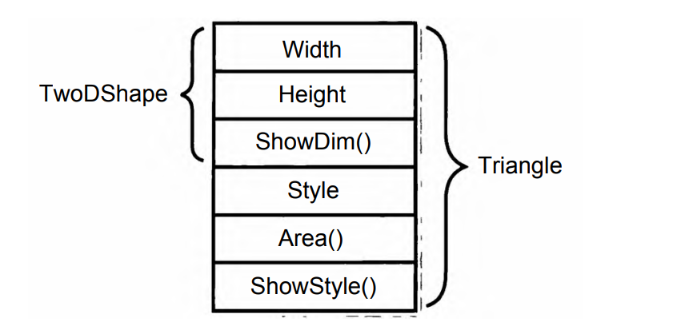
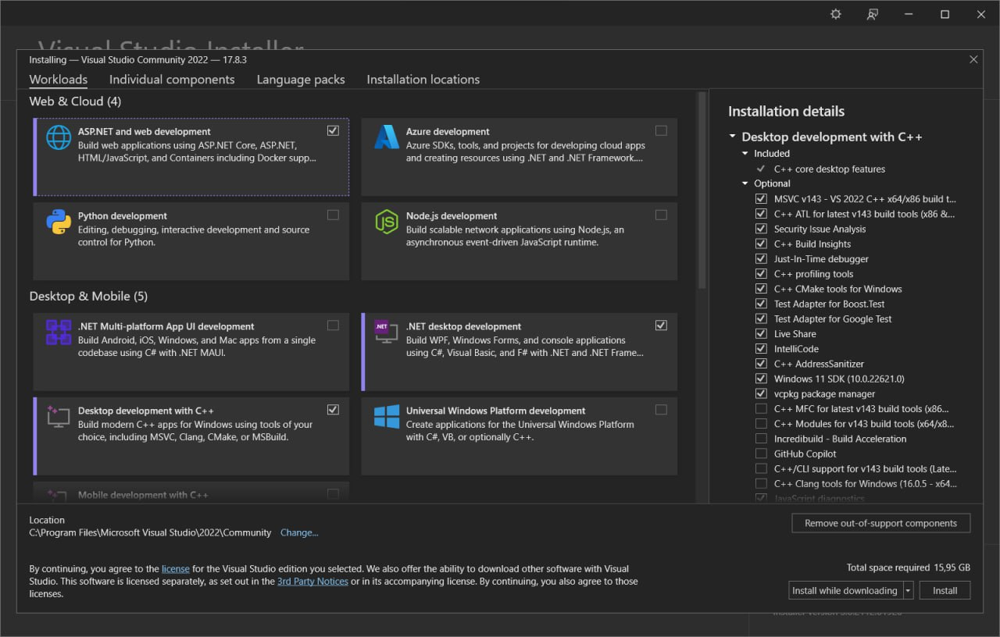
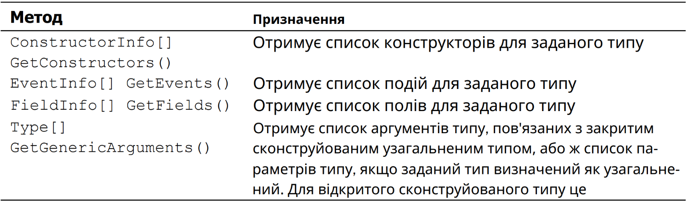
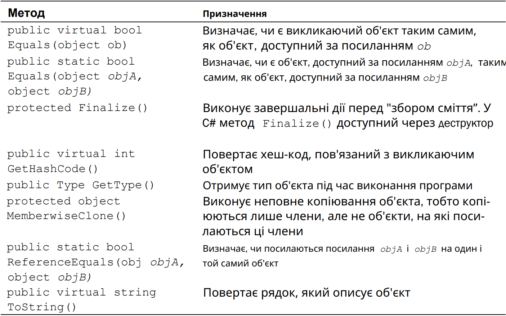
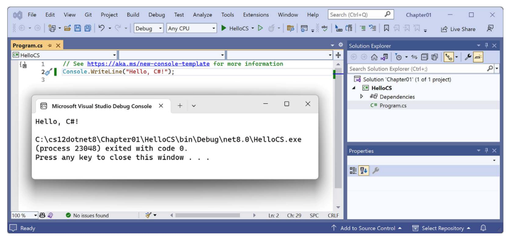
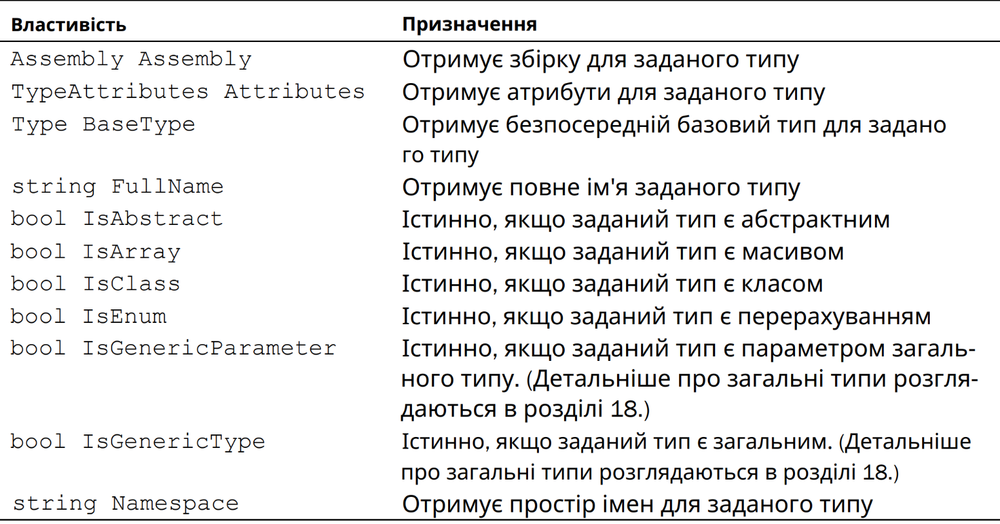

# Введення у програмування та встановлення середовища розробки

[◀️ До змісту лекцій](README.md)

---

1.1 Історичні факти

Англійський математик XIX століття Шенкс витратив понад 20 років свого життя на обчислення числа Пі з точністю до 707 значущих цифр після коми. Цей результат отримав славу рекорду обчислень XIX століття. Однак згодом було виявлено, що Шенкс помилився в 520-му знаку, і тому всі наступні значущі цифри були обчислені невірно.

У 1804 році французький винахідник Жозеф Марі Жаккар створив «програмно-керований» ткацький верстат. Для керування верстатом використовувалися перфокарти, з'єднані одна з одною у вигляді стрічки. Дерев'яні шпильки «читаючого пристрою» верстата за розташуванням отворів у перфокарті визначали, які нитки слід підняти, а які опустити для отримання потрібного візерунка.

У 1890 році в США винахідник Герман Голлеріт розробив електромеханічну лічильну машину – табулятор, керований перфокартами. Вона була використана для скла- дання таблиць із результатами перепису населення США. Заснована Голлерітом фірма з виробництва табуляторів згодом перетворилася на корпорацію International Business Machines (IBM).

У 1936 році двадцятип’ятирічний студент Кембріджського університету англієць Алан Тюрінг опублікував статтю «Про обчислювані числа», у якій розглядався гіпотетичний пристрій («машина Тюрінга»), придатний для вирішення будь-якої математичної або логічної задачі, яку можливо розв'язати, – прообраз програмованого комп'ютера.

У 1941 році німецький інженер Конрад Цузе побудував діючий комп'ютер Z3, у якому використовувалася двійкова система числення. Програми записувалися на перфострічці.

У 1945 році у вищому технічному училищі Пенсільванського університету (США) фізик Джон Моклі та інженер Джон Преспер Екерт побудували повністю електронну машину ENIAC. Аби задати програму, було необхідно вручну встановити тисячі перемикачів, увіткнути сотні штекерів у гнізда контактної панелі. 1 червня 1945 року був розісланий звіт американського математика угорського походження Джона фон Неймана

«Попередній звіт по EDVAC», що містить концепцію зберігання команд комп'ютера в його власній внутрішній пам'яті.

21 червня 1948 року в Манчестерському університеті (Великобританія) на машині «Марк-1» виконана перша у світі програма, що зберігається в пам’яті машини, – пошук найбільшого співмножника заданого числа.

У 1949 році під керівництвом Моріса Вілкса був створений комп'ютер EDSAC. Проектувальники EDSAC ввели систему мнемонічних позначень, де кожна машинна команда представлялася однією великою літерою, та автоматизували налаштування підпрограм на певне місце в пам’яті. Моріс Вілкс назвав мнемонічну схему й бібліотеку підпрограм «збираюча система» (assembly system) – звідси слово «асемблер».

У 1949 році у Філадельфії (США) під керівництвом Джона Моклі був створений «Короткий код» – перший примітивний інтерпретатор мови програмування.

У 1951 році у фірмі Remington Rand американська програмістка Ґрейс Гоппер розробила першу транслюючу програму. Гоппер назвала її компілятором (compiler – компілятор).

У 1957 році на 20-му поверсі штаб-квартири фірми IBM на Медісон-авеню в Нью-Йорку народилася мова Фортран (FORmula TRANslation — трансляція формул). Групою розробників керував 30-річний математик Джон Бекус. Фортран – перша зі «справжніх» мов високого рівня.

У 1963 році була створена мова програмування Бейсик. Засновниками мови стали Джон Кемені і Томас Курц, співробітники Дартмут Коледжу. Під керівництвом творців мова була реалізована групою студентів коледжу. Найперший діалект мови називався Dartmouth BASIC.

У 1958-1968 роках велася розробка та удосконалення мови програмування під назвою АЛГОЛ, назва якої походить від словосполучення «алгоритмічна мова» (algorithmic language). На відміну від Фортрана, який переважно використовувався в США й Канаді, АЛГОЛ був широко розповсюджений у Європі та СРСР. Мова була створена міжнародним комітетом, до складу якого входили європейські та американські вчені – Джон Бекус, Пітер Наур, Воллі Фойрцойг, Ніклаус Вірт.

У 1970 Ніклаус Вірт створив мову програмування, назву якій дав на честь французького фізика й математика Блеза Паскаля. Паскаль планувався Віртом, як мова, що навчає процедурному програмуванню. У 1972 році 31-річний фахівець з системного програмування, який працював у фірмі Bell Labs, Денніс Рітчі розробив мову програмування Сі.

Перший опис мови був представлений у книзі Б. Кернігана і Д. Рітчі, яку було перекладено на українську. Тривалий час цей опис був стандартом, проте низка моментів допускала неоднозначне тлумачення, яке породило безліч трактувань мови Сі. Для виправлення цієї ситуації при Американському інституті національних стандартів (АNSI) був створений комітет зі стандартизації мови Сі.

У 1983 році був затверджений стандарт мови Сі, який отримав назву ANSI С.

На початку 80-х років у Веll Lаbоratory Б'ярн Страуструп, у результаті доповнення й розширення мови Сі, створив нову по суті мову, що отримала назву «Сі з класами». У 1983 році ця назва була замінена на С++.

23 травня 1995 року компанія Sun Microsystems випустила нову мову програмування під назвою Oak. Мова була розроблена для програмування побутової електроніки. Надалі Oak був перейменований на мову Java і почав широко використовуватися в розробці додатків і серверного програмного забезпечення.

У 2000-2001 роках була прийнята і стандартизована нова мова програмування C# (Сі-шарп), спеціально розроблена для платформи .NET. У створенні мови брали участь співробітники Microsoft Research (НДІ при корпорації Microsoft) – Андерс Гейлсберг, Скот Вілтамут, Пітер Гольде та інші відомі фахівці, зокрема Ерік Меєр. Версія мови – С# 2.0 була представлена навесні 2005 року. Варто зазначити, що однією з мов, що слугували базою для С#, був старий-добрий С++.

Після того, як ми зробили невелику подорож у минуле, ми можемо переходити до сьогодення. Для подальшої роботи нам з вами безумовно знадобиться програмне забезпечення. У зв'язку зі швидким розвитком ринку IT-технологій постійно створюються більш нові версії різних програм. У наступних розділах уроку ми розглянемо основи побудови алгоритмів та інсталяцію програмного продукту, який ми будемо використовувати у межах процесу навчання.

1.2 Мова програмування С#

C# (вимовляється як "сі шарп") – сучасна об'єктно-орієнтована та типобезпечна мова програмування. C# дозволяє розробникам створювати різні види безпечних та надійних додатків, які виконуються в середовищі .NET. C# відноситься до відомого сімейства мов C і буде знайомим для кожного, хто працював з C, C++, Java або JavaScript. Тут наведено огляд основних компонентів мови C# 8 та ранніх версій. Якщо ви бажаєте вивчити мову за допомогою інтерактивних прикладів, рекомендуємо користуватися вступними посібниками з C#.

C# – об'єктно-орієнтована, орієнтована на компоненти мова програмування. C# надає мовні конструкції для безпосередньої підтримки цього підходу. Тому C# підходить для створення та використання програмних компонентів. З моменту створення мова C# була збагачена функціями для підтримки нових завдань та сучасними рекомендаціями щодо розробки програмного забезпечення. Головним чином C# – об'єктно-орієнтована мова. Ви визначаєте типи та їхню поведінку.

Ось лише кілька можливостей мови C#, які дозволяють створювати надійні та стійкі додатки. Автоматична збірка сміття автоматично звільняє пам'ять, зайняту недосяжними та невикористаними об'єктами. Типи, які допускають значення null, забезпечують захист від змінних, які не посилаються на виділені об'єкти. Обробка винятків надає структурований та розширюваний підхід до виявлення помилок та відновлення після них. Лямбда-вирази підтримують функціональне програмування. Синтаксис LINQ створює загальний шаблон для роботи з даними з будь-якого джерела. Підтримка мов для асинхронних операцій надає синтаксис для створення розподілених систем. У C# є Єдина система типів. Усі типи C#, включаючи примітивні типи, такі як int і double, успадковують від одного кореневого типу object. Усі типи використовують спільний набір операцій, і значення будь-якого типу можна зберігати, передавати і обробляти подібним чином. Крім того, C# підтримує як визначені користувачем посилальні типи, так і типи значень. C# дозволяє динамічно виділяти об'єкти та зберігати спрощені структури в стеку. C# підтримує універсальні методи та типи, які забезпечують підвищену безпеку типів та продуктивність. C# надає ітератори, які дозволяють розробникам класів колекцій визначати користувацькі варіанти поведінки для клієнтського коду.

1.3 Основи програмування

Програма (часто називається програмним забезпеченням або софтвером) – це набір інструкцій, написаних для комп'ютера або іншого обчислювального пристрою, які вказують йому, як виконувати певні завдання або функції. Програми розробляються, щоб реалізувати різноманітні завдання, включаючи обробку даних, створення графіки, взаємодію з користувачем, управління апаратними ресурсами і багато іншого.

Програми можуть бути дуже різними за своїм призначенням і складністю. Вони включають у себе операційні системи (як Microsoft Windows, macOS або Linux), текстові редактори, браузери, гри, програми для обробки зображень, бази даних, мобільні додатки і багато інших видів програм.

Програмне забезпечення може бути написане різними мовами програмування, такими як C++, Java, Python, JavaScript і багато інших. Воно також може бути виконуваним на різних платформах, включаючи комп'ютери, смартфони, планшети, вбудовані системи та інші пристрої.

Програми важливі для функціонування сучасних комп'ютерів і пристроїв, і вони дозволяють нам виконувати різноманітні завдання і завдяки ним можна отримувати користь від обчислювальної технології.

Компілятор – це програма, яка перетворює вихідний код, написаний мовою програмування, на машинний код або іншу форму, яку може розуміти комп'ютер (наприклад, байт-код для виконання на віртуальній машині). Процес цієї трансформації називається компіляцією.

Основна мета компілятора – перетворити програмний код, написаний програмістом, в такий формат, що комп'ютер може виконувати безпосередньо, без необхідності знову і знову перекладати його в машинний код. Компілятори допомагають покращити продуктивність і швидкість виконання програм, оскільки машинний код може бути виконаний швидше, ніж вихідний код.

Ось декілька ключових понять, пов'язаних з компіляторами:

1. Вихідний код: Це програмний код, який написаний програмістом на мові програмування, такій як C++, Java, Python тощо.

2. Машинний код: Це низькорівневий код, який зрозумілий комп'ютеру і може бути безпосередньо виконаний процесором.

3. Байт-код: Деякі компілятори перетворюють вихідний код у байт-код, який виконується на віртуальній машині. Наприклад, мови програмування Java використовують байт-код для виконання на віртуальній машині Java (JVM).

4. Оптимізація: Компілятори можуть виконувати оптимізації, щоб поліпшити продуктивність програми, зменшити використання пам'яті і виконати інші покращення в коді.

За допомогою компіляторів програми можуть бути перетворені в ефективний машинний код або байт-код, що дозволяє їм виконуватися на різних обчислювальних платформах та забезпечує більш високу продуктивність і швидкість виконання.

Біт (від англійського "bit", що означає "binary digit") - це основна одиниця інформації в обчислювальній техніці і теорії інформації. Біт є найменшим можливим вимірником інформації і може приймати два можливих значення: 0 або 1.

Біти використовуються для представлення та обробки інформації в комп'ютерах. За допомогою комбінації бітів можна представити різні типи даних, такі як числа, символи, зображення, звуки і т. д. Кожен біт відповідає за один бінарний параметр, який може бути використаний для представлення стану або значення.

Група бітів може утворювати більш складні структури даних, такі як байти (8 бітів), слова (зазвичай 16 або 32 біти), а також числа подовженої точності або довгих послідовностей бітів для зберігання тексту, звуків і зображень.

Основний вимірник ємності пам'яті комп'ютера в бітах або байтах. Наприклад, 8 бітів утворюють 1 байт, і це базова одиниця для зберігання текстової інформації в багатьох комп'ютерних системах. Більше бітів дозволяють зберігати більше інформації і виконувати більш складні обчислення.

Двійкова система числення, також відома як бінарна система, це система числення, яка використовує дві цифри: 0 і 1. Вона є однією з основних систем числення в інформатиці і електроніці, оскільки в комп'ютерах та цифрових пристроях інформація зазвичай представлена у вигляді двійкового коду через використання двох станів, наприклад, включено або виключено.

Основні поняття двійкової системи числення:

1. Цифри: У двійковій системі лише дві цифри, 0 і 1. Вони представляють відсутність сигналу (0) і наявність сигналу (1) або відповідно виключено і включено.

2. Позиційна система: Двійкова система числення є позиційною системою числення, де значення кожної позиції в числі визначається її місцем у числі. Наприклад, в двійковому числі "1010", перший символ зліва (1) представляє 2^3 (восьме число), другий (0) представляє 2^2 (четверте число), третій (1) представляє 2^1 (друге число), і четвертий (0) представляє 2^0 (перше число).

3. Перетворення з інших систем числення: Двійкову систему можна отримати з інших систем числення, наприклад, з десяткової, шістнадцяткової або вісімкової, використовуючи відповідні правила перетворення.

4. Використання в комп'ютерах: Всі дані в комп'ютерах, включаючи текст, зображення, відео і програми, зазвичай представлені у вигляді двійкового коду. Комп'ютери виконують операції з даними, використовуючи цей двійковий код.

5. Арифметика в двійковій системі: У двійковій системі можна виконувати арифметичні операції, такі як додавання, віднімання, множення і ділення, використовуючи правила арифметики для двійкових чисел.

Приклади двійкових чисел:

- 0 (десяткове 0)

- 1 (десяткове 1)

- 10 (десяткове 2)

- 11 (десяткове 3)

- 100 (десяткове 4)

- 101 (десяткове 5)

- і так далі...

Двійкова система числення важлива в інформатиці і технологіях через її прямий зв'язок із способом представлення та обробки інформації в комп'ютерах.

1.4 Архітектура .NET

Програми на C# виконуються в середовищі .NET, віртуальній системі виконання, яка викликає Common Language Runtime (CLR) та набір бібліотек класів. Середовище CLR є реалізацією Common Language Infrastructure (CLI), яка є міжнародним стандартом, розробленим корпорацією Microsoft. CLI служить основою для створення середовищ виконання та розробки, де мови та бібліотеки можуть безперешкодно співпрацювати.

Вихідний код, написаний на C#, компілюється в Проміжкову Мову (IL), яка відповідає специфікаціям CLI. Код IL, разом із ресурсами, такими як растрові зображення та рядки, зберігається в збірці, зазвичай з розширенням .dll. Збірка містить маніфест із інформацією про типи, версії, мову та регіональні налаштування для цієї збірки.

Під час виконання програми на C# збірка завантажується в середовище CLR. CLR виконує компіляцію Just-In-Time (JIT) коду IL в машинні інструкції. Крім цього, CLR виконує інші операції, такі як автоматичне збирання сміття, обробка винятків та управління ресурсами. Код, який виконується CLR, іноді називають "керованим кодом", в той час як "некерований код" компілюється в машинний код, специфічний для платформи.

Можливість взаємодії між різними мовами є ключовою особливістю .NET. Код IL, згенерований компілятором C#, відповідає специфікаціям Загальної Системи Типів (CTS). Код IL, згенерований з коду C#, може взаємодіяти з кодом, згенерованим з інших мов .NET, таких як F#, Visual Basic та C++. Існує понад 20 інших мов, сумісних із CTS. Одна збірка може містити кілька модулів, написаних різними мовами .NET, і всі типи можуть посилатися один на одного, якщо вони були написані однією мовою.

Крім сервісів часу виконання, .NET також включає розширені бібліотеки класів. Ці бібліотеки підтримують різноманітні види завдань та організовані у простори імен, які надають різні корисні можливості, від операцій вводу та виводу файлів до маніпулювання рядками та розбору XML, від платформ для веб-додатків до елементів керування Windows Forms. Зазвичай програми на C# активно використовують бібліотеку класів .NET для вирішення загальних завдань.

1.5 Налаштування середовища розробки

Перед тим як почати програмувати, вам знадобиться редактор коду для мови C#. У Microsoft є родина редакторів коду та інтегрованих середовищ розробки (IDE), до яких включаються:

Visual Studio 2022 для Windows

Visual Studio Code для Windows, Mac або Linux

Visual Studio Code для вебу або GitHub Codespaces

Також сторонні розробники створили власні редактори коду для C#, наприклад, JetBrains Rider, який доступний для Windows, Mac або Linux, але вимагає ліцензійних витрат. JetBrains Rider є популярним серед досвідчених розробників .NET.

Ми рекомендуємо використовувати Visual Studio 2022 Community під операційною системою Windows, для інших ОС рекомендуємо Visual Studio Code.

1.5.1 Завантаження та встановлення Visual Studio 2022

Багато професійних розробників .NET використовують Visual Studio 2022 для Windows у своїй повсякденній роботі. Навіть якщо ви вибираєте використовувати Visual Studio Code для виконання завдань з кодування у цій книзі, вам може бути корисно ознайомитися також з Visual Studio 2022 для Windows. Це не до того моменту, поки ви не напишете достатню кількість коду з використанням інструменту, ви не зможете дійсно визначити, чи він відповідає вашим потребам.

Якщо у вас немає комп'ютера з операційною системою Windows, ви можете пропустити цей розділ і перейти до наступного розділу, де ви завантажите та встановите Visual Studio Code на macOS або Linux.

Починаючи з жовтня 2014 року, Microsoft надає студентам, внескідаткам та індивідуальним користувачам професійну версію Visual Studio безкоштовно. Це називається Community Edition (Версія Спільноти). Якщо ви ще не встановили її, давайте це зробимо зараз:

Завантажте Microsoft Visual Studio 2022 версії 17.8 або пізніше для Windows за наступним посиланням: https://visualstudio.microsoft.com/downloads/.

Запустіть встановлювач для початку встановлення. Перейти до вкладки “Language packs” та вибрати англійську мову інтерфейсу (рисунок 1.1).



*Рисунок 1.1*

Рисунок 1.1 – Встановлення Microsoft Visual Studio 2022


*Рисунок 1.1*

На вкладці Робочі завдання виберіть наступне:

Розробка ASP.NET і веб-додатків.

Розробка .NET для робочого столу (так як це включає консольні програми).

Розробка для робочого столу на C++ з усіма стандартними компонентами (це дозволить опубліковувати консольні програми та веб-сервіси, які працюють швидше та займають менше пам'яті).

На рисунку 1.2 наведена вкладка Робочі завдання.

Рисунок 1.2 – Вкладка Робочі завдання



*Рисунок 1.2*

Далі натисніть "Встановити" та зачекайте, поки встановлювач завантажить обране програмне забезпечення та встановить його.

Після завершення встановлення натисніть "Запустити".

Перший раз, коли ви запускаєте Visual Studio, вас попросять увійти в систему. Якщо у вас є обліковий запис Microsoft, ви можете використовувати його. Якщо немає, то зареєструйтеся за новою адресою за наступним посиланням: https://signup.live.com/.

Також в перший раз, коли ви запускаєте Visual Studio, вас попросять налаштувати своє середовище. Для налаштувань розробки виберіть "Visual C#". Щодо кольорової теми, я вибрав "Синя", але ви можете вибрати те, що вам подобається.

1.5.2 Завантаження та встановлення Visual Studio Code

Завантажте та встановіть або стабільну версію, або версію Insiders Visual Studio Code за наступним посиланням: https://code.visualstudio.com/.

Завантажте та встановіть .NET SDK версії 8.0: https://www.microsoft.com/net/download.

Щоб встановити розширення C# Dev Kit з графічним інтерфейсом користувача, спочатку запустіть застосунок Visual Studio Code.

У Visual Studio Code натисніть іконку Extensions або перейдіть в Меню | Розширення.

Розширення C# Dev Kit - одне з найпопулярніших доступних розширень, тому ви повинні побачити його вгорі списку, або ви можете ввести "C#" у поле пошуку.

Натисніть "Встановити" та зачекайте, поки завантажуються та встановлюються підтримуючі пакети.

Розширення та їх ідентифікатори та опис:

1. C# Dev Kit

Ідентифікатор: `ms-dotnettools.csdevkit`.

Офіційне розширення C# від Microsoft. Управління вашим кодом за допомогою об'єкта розв'язку та тестування коду з можливістю виявлення та виконання інтегрованих юніт-тестів.

Включає розширення C# та IntelliCode для C# Dev Kit.

2. C#

Ідентифікатор: `ms-dotnettools.csharp`.

Підтримка редагування C#, включаючи підсвічування синтаксису, IntelliSense, перехід до визначення, пошук всіх посилань, підтримку відлагодження для .NET і підтримку проектів csproj на Windows, macOS і Linux.

3. IntelliCode для C# Dev Kit

Ідентифікатор: `ms-dotnettools.vscodeintellicode-csharp`.

Надає функції розробки з підтримкою штучного інтелекту для розробників Python, TypeScript/JavaScript, C# та Java.

4. MSBuild project tools

Ідентифікатор: `tintoy.msbuild-project-tools`.

Надає підтримку IntelliSense для файлів проекту MSBuild, включаючи автодоповнення для елементів `<PackageReference>`.

5. Polyglot Notebooks

Ідентифікатор: `ms-dotnettools.dotnet-interactive-vscode`

Це розширення додає підтримку використання .NET та інших мов у блокноті. Воно має залежність від розширення Jupyter (ms-toolsai.jupyter), яке, в свою чергу, має власні залежності.

1.6 Створення першого проекту в Visual Studio 2022

Давайте розпочнемо написання коду:

Запустіть Visual Studio 2022. Ви можете побачити експериментальну нову вкладку Welcome, яка замінює старий діалоговий вікно, як показано на рисунку 1.3.

Рисунок 1.3 – Нова вкладка Welcome



*Рисунок 1.3*

В вкладці Welcome натисніть "New Project" (Створити новий проект), або якщо ви використовуєте версію з модальним діалоговим вікном Visual Studio 2022, то в розділі "Get started" (Початок роботи) натисніть "Create a new project" (Створити новий проект):

У діалоговому вікні "Створити новий проект" виберіть мову C# для фільтрації шаблонів проектів, а потім у полі "Пошук шаблонів" введіть "console" і виберіть "Console App", переконайтеся, що ви вибрали шаблон кросплатформенного проекту, а не для .NET Framework, який призначений лише для Windows, і шаблон проекту на C#, а не іншу мову, таку як Visual Basic або TypeScript. Ваш вибір повинен бути схожим на показаний на рисунку 1.4.

Рисунок 1.4 – Створення нового проекту



*Рисунок 1.4*

Далі натисніть на кнопку “Next”. У діалоговому вікні "Налаштування нового проекту" введіть наступну інформацію:

- Назва проекту: HelloCS.

- Місцезнаходження: C:\cSharp “Або будь-яку іншу локацію”.

- Назва рішення: Chapter01.

Потім натисніть на кнопку “Next”. В діалоговому вікні "Додаткова інформація" у випадаючому списку "Framework" (Фреймворк) зверніть увагу, що вибори .NET SDK вказують, чи ця версія є "Standard Term Support" (Підтримка стандартного терміну), "Long Term Support" (Підтримка довгострокового використання), "Preview" (Попередній перегляд) або "Out of support" (Закінчено підтримку), а потім виберіть .NET 8.0 (Long Term Support) (довгострокову підтримку).

Залиште прапорець під назвою "Do not use top-level statements" (Не використовувати заяви верхнього рівня) знятим. Про це більш детально нижче.

Далі натисніть кнопку “Create”

Якщо ви не бачите "Solution Explorer" (Провідник рішень), то перейдіть до "View" (Вид) | "Solution Explorer" (Провідник рішень).

Якщо код не відображається, то в "Solution Explorer" (Провіднику рішень) двічі клацніть на файлі з назвою Program.cs, щоб відкрити його як на рисунку 5.

Рисунок 1.5 – Створений проект



*Рисунок 1.5*

У файлі Program.cs відзначте, що код складається лише з коментаря та одного оператора, як наведено в лістингу 1.1.

Лістинг 1.1 – Код файлу Program.cs

// See https://aka.ms/new-console-template for more information

```csharp
Console.WriteLine("Hello, World!");
```

Цей код містить коментар та один оператор, який виводить рядок “Hello World” на консоль.

1.7 Компіляція і запуск першого проекту

У Visual Studio перейдіть до "Debug" (Відлагодження) | "Start Without Debugging" (Запустити без відлагодження). Результат наведений на рисунку 1.6.

Рисунок 1.6 – Результат виконання проекту



*Рисунок 1.6*

Натисніть будь-яку клавішу, щоб закрити вікно консольного додатку і повернутися до Visual Studio.

1.8 Структура програми

Будь-яка програма потребує точки входу яка буде виконуватися зразу після запуску програми. В с# є два підходи як це зробити більш класичний якщо не залишати прапорець під назвою "Do not use top-level statements" (Не використовувати заяви верхнього рівня) знятим. Ми отримаємо наповнення файлу Program.cs як у лістингу нижче (лістинг 1.2).

Лістинг 1.2 – Файл Program.cs

```csharp
using System; // Імпорт бібліотеки для доступу до стандартних класів
namespace MyNamespace // Оголошення простору імен
```

// Головний клас програми

```csharp
class Program
```

// Головний метод програми (точка входу)

```csharp
static void Main(string[] args)
Console.WriteLine("Привіт, світ!"); // Виведення рядка на консоль
```

// Інші інструкції та код програми

// Інші класи, функції та об'єкти можуть бути оголошені тут

Давайте розглянемо кожен з елементів структури програми на C#:

1. using: Інструкція `using` використовується для імпорту бібліотеки (простору імен), яка містить класи та функції, необхідні для роботи програми. У прикладі вище ми імпортуємо простір імен `System`, що містить стандартні класи, такі як `Console` і багато інших;

2. namespace: Простір імен (namespace) служить для організації коду в логічні групи. Всі класи і об'єкти, оголошені всередині простору імен, мають доступ один до одного;

3. class: Клас - це основна будівельна одиниця програми C#. Ви можете мати багато класів в одному просторі імен. У прикладі вище є клас `Program`, який містить точку входу в програму;

4. Main() метод: Метод `Main()` є точкою входу в програму. Він має статичний модифікатор (`static`), оскільки він викликається без створення екземпляра класу. Цей метод отримує масив рядків `string[] args`, який може містити аргументи командного рядка;

```csharp
5. Console.WriteLine(): Цей метод виводить рядок тексту на консоль. В даному прикладі виводиться "Привіт, світ!".
```

Поки ми будемо використовувати більш просту структуру де фактично ми описуємо лише наповнення методу Main() і максимально фокусуємося на виконанні наших задач. Із усіма пунктами вище ми будемо знайомитися детально на наступних заняттях.

1.9 Обробка синтаксичних помилок

Якщо ви тільки починаєте вивчати програмування, вам слід навчитися правильно тлумачити (і реагувати на) помилки, які можуть виникнути при спробі скомпілювати програму. Більшість помилок компіляції виникає в результаті друкарських помилок у вихідному тексті програми. Всі програмісти рано або пізно виявляють, що при друкуванні вихідного тексту програми дуже легко допустити друкарську помилку. Звичайно, якщо ви введете щось неправильно, компіля тор видасть відповідне повідомлення про синтаксичну помилку при спробі скомпі лювати вашу програму. У такому повідомленні зазвичай вказується номер рядка вихідного тексту програми, де була виявлена помилка, а також коротко описується характер помилки.

Незважаючи на всю корисність повідомлень про синтаксичні помилки, які видає компілятор, вони іноді вводять в оману. Адже компілятор C# намагається витягнути якийсь зміст з вихідного тексту, яким би він не був набраний. Саме з цієї причини помилка, про яку повідомляє компілятор, не завжди відображає справжню причину виникнення проблеми. Ненавмисний пропуск відкриваючої фігурної дужки після методу Main() у розглянутому вище прикладі програми призводить до появи наведеної нижче послідовності повідомлень про помилки при компіляції даної програми компілятором командного рядка csc. (Аналогічні помилки з'являються при компіляції в інтегрованому середовищі розробки Visual Studio.)

EX1.CS(12, 21) : помилка CS1002: ; очікувалось

ЕХ1.CS(13, 22) : помилка CS1519: Неприпустимий лексема '(' в оголошенні члена класу, структури або інтерфейсу

EX1.CS(15, 1) : помилка CS1022: Потрібне визначення типу або простору імен або ознака кінця файлу

Очевидно, що перше повідомлення про помилку не можна вважати правильним, оскільки пропущена крапка з комою, а фігурна дужка. Два інших повідомлення про помилки вносять таке ж плутанину.

З усього вищевикладеного випливає, що якщо програма містить синтаксичну помилку, то повідомлення компілятора не слід розуміти буквально, оскільки вони можуть ввести в оману. Для виявлення справжньої причини помилки може знадобитися критичний перегляд повідомлення про помилку.

Крім того, корисно проаналізувати кілька рядків коду, що передують тому рядку, в якому виявлена повідомлювана помилка. Іноді про помилку повідомляється лише через кілька рядків після того місця, де вона дійсно сталася.


---

[◀️ До змісту](../README.md)
