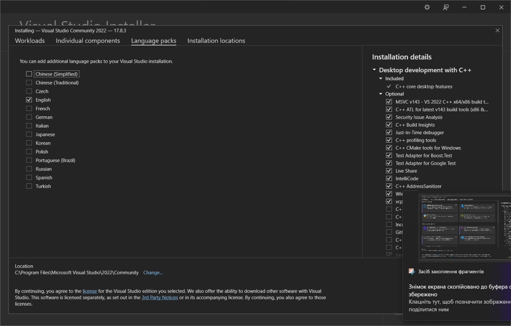
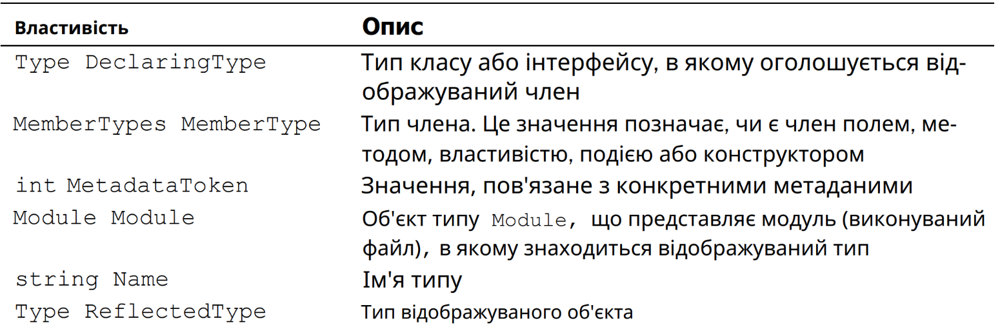
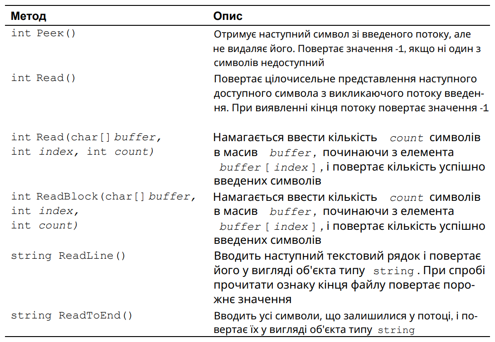

# Масиви та рядки

[◀️ До змісту лекцій](README.md)

---

У цьому розділі знову йтиметься про типи даних в С#. Тут розглядаються масиви і тип string, а також оператор циклу foreach.

6.1 Масиви

Масив представляє собою сукупність змінних одного типу з загальним ім'ям для доступу до них. У C# масиви можуть бути як одновимірними, так і багатовимірними , хоча найчастіше використовуються одновимірні масиви. Масиви використовуються для різних цілей, оскільки вони надають зручні засоби для об'єднання пов'язаних змінних. Наприклад, у масиві можна зберігати максимальні денні температури, зареєстровані протягом місяця, перелік біржових курсів або назви книг з програмування з домашньої бібліотеки. Основна перевага масиву полягає в організації даних таким чином, щоб ними було легше маніпулювати. Наприклад, якщо є масив, що містить дивіденди, виплачувані за певною групою акцій, то, організувавши циклічний доступ до елементів цього масиву, можна без особливих зусиль розрахувати середній дохід від цих акцій. Крім того, масиви дозволяють організувати дані таким чином, щоб легко відсортувати їх. Масивами в C# можна користуватися практично так само, як і в інших мовах програмування. Тим не менш у них є одна особливість: вони реалізовані у вигляді об'єктів. Реалізація масивів у вигляді об'єктів надає ряд суттєвих переваг, і далеко не останнім серед них є можливість утилізувати невикористані масиви за допомогою "збору сміття".

6.1.1 Одновимірні масиви

Одновимірний масив представляє собою список зв'язаних змінних. Такі списки часто використовуються в програмуванні. Наприклад, в одновимірному масиві можна зберігати облікові номери активних користувачів мережі або поточні середні рівні досягнень бейсбольної команди.

Для того, щоб скористатися масивом у програмі, потрібна двоетапна процедура, оскільки в C# масиви реалізовані у вигляді об'єктів. По-перше, необхідно оголосити змінну, яка може звертатися до масиву. І по-друге, потрібно створити екземпляр масиву, використовуючи оператор new. Так, для оголошення одновимірного масиву зазвичай застосовується наступна загальна форма:

тип[] ім'я_масиву = new тип[розмір];

де тип оголошує конкретний тип елемента масиву. Тип елемента визначає тип даних кожного елемента, що складає масив. Зверніть увагу на квадратні дужки, які супроводжують тип . Вони вказують на те, що оголошується одновимірний масив. А розмір визначає кількість елементів масиву.

ПРИМІТКА. Якщо у вас є деякий досвід програмування на С або C++, зверніть особливу увагу на те, як оголошуються масиви в С#. Зокрема, квадратні дужки йдуть після назви типу, а не імені масиву.

Звернемося до конкретного прикладу. У наведеному нижче коді створюється масив типу int, який складається з десяти елементів і пов'язується зі змінною посилання на масив, що називається sample.

int[] sample = new int[10];

У змінній sample зберігається посилання на область пам'яті, виділену для масиву оператором new. Ця область пам'яті повинна бути достатньо великою, щоб в ній могли зберігатися десять елементів масиву типу int.

Як і при створенні екземпляра класу, наведене вище оголошення масиву можна розділити на два окремі оператори. Наприклад:

int[] sample;

sample = new int[10];

У цьому випадку змінна sample не посилається на який-небудь конкретний фі зичний об'єкт, коли вона створюється в першому операторі. І лише після виконання другого оператора ця змінна посилається на масив.

Доступ до окремого елемента масиву здійснюється за індексом: Індекс позначає положення елемента в масиві. У мові C# індекс першого елемента всіх масивів виявляється нульовим. Зокрема, масив sample складається з 10 елементів з індексами від 0 до 9. Для індексування масиву достатньо вказати номер потрібного елемента в квадратних дужках. Так, перший елемент масиву sample позначається як sample [0], а останній його елемент — як sample[9]. Нижче наведено приклад програми, в якій заповнюються всі 10 елементів масиву sample (лістинг 6.1).

Лістинг 6.1 – Відобразити одновимірний масив

// Показати одновимірний масив.

```csharp
using System;
class ArrayDemo
static void Main()
```

int[] sample = new int[10];

int i;

for (i = 0; i < 10; i = i + 1)

sample[i] = i;

for (i = 0; i < 10; i = i + 1)

```csharp
Console.WriteLine("sample[" + i + "]: " + sample[i]);
```

При виконанні цієї програми отримується наступний результат.

sample[0]: 0

sample[1]: 1

sample[2]: 2

sample[3]: 3

sample[4]: 4

sample[5]: 5

sample[6]: 6

sample[7]: 7

sample[8]: 8

sample[9]: 9

Схематично масив sample можна представити таким чином (рисунок 6.1).



*Рисунок 6.1*

Рисунок 6.1 – Схематичне представлення масиву


*Рисунок 6.1*

Масиви часто використовуються в програмуванні, оскільки вони дають можливість легко оперувати великою кількістю взаємопов'язаних змінних. Наприклад, у наведеній нижче програмі виявляється середнє арифметичне ряду значень, що зберігаються в масиві nums, який циклічно опитується за допомогою оператора циклу for (лістинг 6.2).

Лістинг 6.2 – Обчислення середнього арифметичного ряду значень

// Обчислити середнє арифметичне ряду значень.

```csharp
using System;
class Average
static void Main()
```

int[] nums = new int[10];

int avg = 0;

nums[0] = 99;

nums[1] = 10;

nums[2] = 100;

nums[3] = 18;

nums[4] = 78;

nums[5] = 23;

nums[6] = 63;

nums[7] = 9;

nums[8] = 87;

nums[9] = 49;

for (int i = 0; i < 10; i++)

avg = avg + nums[i];

avg = avg / 10;

```csharp
Console.WriteLine("Середнє: " + avg);
```

Результат виконання цієї програми виглядає наступним чином.

Середнє: 53

6.1.2 Ініціалізація масиву

У вищезазначеній програмі початкові значення були задані для елементів масиву nums вручну в десяти окремих операторах присвоєння. Звичайно, така ініціалізація масиву абсолютно правильна, але те саме можна зробити набагато простіше. Адже масиви можуть ініціалізуватися при їх створенні. Нижче наведена загальна форма ініціалізації одновимірного масиву:

```csharp
тип[] ім'я_масиву = {vall, val2, val3, ..., valN};
```

де val1-valN означають початкові значення, які присвоюються по черзі, зліва направо і за порядком індексування. Для зберігання ініціалізаторів масиву в C# автоматично розподіляється достатня кількість пам'яті. А необхідність користуватися оператором new явно відпадає само собою. Як приклад нижче наведено поліпшену версію програми, що обчислює середнє арифметичне (лістинг 6.3).

Лістинг 6.3 – Обчислення середнього арифметичного ряду значень

// Обчислити середнє арифметичне ряду значень.

```csharp
using System;
class Average
static void Main()
int[] nums = { 99, 10, 100, 18, 78, 23,
63, 9, 87, 49 };
```

int avg = 0;

for (int i = 0; i < 10; i++)

avg = avg + nums[i];

avg = avg / 10;

```csharp
Console.WriteLine("Середнє: " + avg);
```

Цікаво, що при ініціалізації масиву також можна скористатися оператором new, хоча особливої потреби в цьому немає. Наприклад, наведений нижче фрагмент коду вважається правильним, але зайвим для ініціалізації масиву nums у згаданій вище програмі.

```csharp
int[] nums = new int[] { 99, 10, 100, 18, 78, 23, 63, 9, 87, 49 };
```

Незважаючи на свою надмірність, форма ініціалізації масиву з оператором new виявляється корисною у випадку, якщо новий масив присвоюється вже існуючій змінній посилання на масив. Наприклад:

int[] nums;

```csharp
nums = new int[] { 99, 10, 100, 18, 78, 23, 63, 9, 87, 49 };
```

У даному випадку змінна nums оголошується в першому операторі і ініціалізується в другому.

І останнє зауваження: при ініціалізації масиву його розмір можна вказувати явно, але цей розмір повинен збігатися з кількістю ініціалізаторів. Як приклад нижче наведено ще один спосіб ініціалізації масиву nums.

```csharp
int[] nums = new int[10] { 99, 10, 100, 18, 78, 23, 63, 9, 87, 49 );
```

У цьому оголошенні розмір масиву nums задається явно рівним 10.

6.1.3 Дотримання меж масиву

Межі масиву в C# строго дотримуються. Якщо межі масиву не досягаються або перевищуються, то виникає помилка при виконанні. Щоб переконатися в цьому, спробуйте виконати наведену нижче програму, в якій навмисно перевищуються межі масиву (лістинг 6.4).

Лістинг 6.4 – Перевищення меж масиву

// Показати перевищення меж масиву.

```csharp
using System;
class ArrayErr
static void Main()
```

int[] sample = new int[10];

int i;

// Відтворити перевищення меж масиву.

for (i = 0; i < 100; i = i + 1)

sample[i] = i;

Як тільки значення змінної i досягає 10, виникне виняткова ситуація типуIndexOutOfRangeException, пов'язана з виходом за межі індексування масиву, і програма передчасно завершиться.

6.2 Багатовимірні масиви

У програмуванні найчастіше використовуються одновимірні масиви, хоча і багатовимірні не такі рідкі. Багатовимірним називається такий масив, який відрізняється двома або більше вимірами, причому доступ до кожного елементу такого масиву здійснюється за допомогою певної комбінації двох або більше індексів.

6.2.1 Двовимірні масиви

Найпростішою формою багатовимірного масиву є двовимірний масив. Розташування будь-якого елемента в двовимірному масиві позначається двома індексами. Такий масив можна представити у вигляді таблиці, на рядки якої вказує один індекс, а на стовпці - інший.

У наступному рядку коду оголошується двовимірний масив integer розмірами 10×20.

int[,] table = new int[10, 20];

Зверніть особливу увагу на оголошення цього масиву. Як бачите, обидва його розміри розділяються комою. У першій частині цього оголошення синтаксичне позначення [,] означає, що створюється змінна посилання на двовимірний масив. Якщо ж пам'ять розподіляється для масиву за допомогою оператора new, то використовується наступне синтаксичне позначення int[10, 20].

У даному оголошенні створюється масив розмірами 10 × 20, але і в цьому випадку його розміри розділяються комою.

Для доступу до елементу двовимірного масиву слід вказати обидва індекси, розділивши їх комою. Наприклад, у наступному рядку коду елементу масиву table з координата ми розташування (3,5) присвоюється значення 10.

table[3, 5] = 10;

Нижче наведено більш наочний приклад у вигляді невеликої програми, в якій двовимірний масив спочатку заповнюється числами від 1 до 12, а потім виводиться його зміст (лістинг 6.5).

Лістинг 6.5 – Показати двовимірний масив

// Показати двовимірний масив.

```csharp
using System;
class TwoD
static void Main()
```

int t, i;

int[,] table = new int[3, 4];

for (t = 0; t < 3; ++t)

for (i = 0; i < 4; ++i)

table[t, i] = (t * 4) + i + 1;

```csharp
Console.Write(table[t, i] + " ");
Console.WriteLine();
```

У даному прикладі елемент масиву table[0,0] буде мати значення 1, елемент масиву table[0,1]— значення 2, елемент масиву table[0,2]— значення 3 і т.д. А значення елемента масиву table[2,3] виявиться рівним 12. На рисунку 6.2 показано схематичне розташування елементів цього масиву та їх значень.

Рисунок 6.2 – Схематичне зображення масиву table, створеного в програмі TwoD



*Рисунок 6.2*

ПОРАДА. Якщо вам доводилося раніше програмувати на С, C++ або Java, то будьте особливо уважними, оголошуючи або організовуючи доступ до багатовимірних масивів в С#. У цих мовах програмування розміри масиву і індекси вказуються в окремих квадратних дужках, тоді як в C# вони розділяються комою.

6.2.2 Масиви трьох і більше вимірів

В C# допускаються масиви трьох і більше вимірів. Нижче наведена загальна форма оголошення багатовимірного масиву.

тип[,...,] ім'я_масиву = new тип[розмір1, розмір2, ... розмірN];

Наприклад, у наведеному нижче оголошенні створюється тривимірний цілочисельний масив розміром 4 × 10 × 3.

int[,,] multidim = new int[4, 10, 3];

А в наступному операторі елементу масиву multidim з координатами розташування (2,4,1) присвоюється значення 100.

multidim[2, 4, 1] = 100;

Нижче наведено приклад програми, в якій спочатку організується тривимірний масив, що містить матрицю значень 3 × 3 × 3, а потім значення елементів цього масиву сумуються по одній з діагоналей матриці (лістинг 6.6).

Лістинг 6.06 – Додавання значень по одній з діагоналей матриці 3 ×3×3

// Додавання значень по одній з діагоналей матриці 3×3×3.

```csharp
using System;
class ThreeDMatrix
static void Main()
```

int[,,] m = new int[3, 3, 3];

int sum = 0;

int n = 1;

for (int x = 0; x < 3; x++)

for (int y = 0; y < 3; y++)

for (int z = 0; z < 3; z++)

m[x, y, z] = n++;

sum = m[0, 0, 0] + m[1, 1, 1] + m[2, 2, 2];

```csharp
Console.WriteLine("Сума значень по першій діагоналі: " + sum);
```

Ось який результат дає виконання цієї програми.

Сума значень по першій діагоналі: 42

6.2.3 Ініціалізація багатовимірних масивів

Для ініціалізації багатовимірного масиву достатньо заключити в фігурні дужки список ініціалізаторів кожного його розміру. Нижче в якості прикладу наведена загальна форма ініціалізації двовимірного масиву:

```csharp
тип[,] ім'я_масиву = {
{val, val, val, ..., val},
{val, val, val, ..., val},
{val, val, val, ..., val}
```

де val означає ініціалізуюче значення, а кожний внутрішній блок — окремий рядок. Перше значення в кожному рядку зберігається на першій позиції в масиві, друге значення — на другій позиції і т.д. Зверніть увагу на те, що блоки ініціалізаторів розділяються комами, а після завершальної цих блоків закриваючої фігурної дужки ставиться крапка з комою.

Як приклад наведено програму, в якій двовимірний масив sqrs ініціалізується числами від 1 до 10 та квадратами цих чисел (лістинг 6.7).

Лістинг 6.7 – Ініціалізація двовимірного масиву

// Ініціалізувати двовимірний масив.

```csharp
using System;
class Squares
static void Main()
int[,] sqrs = {
{ 1, 1 },
{ 2, 4 },
{ 3, 9 },
{ 4, 16 },
{ 5, 25 },
{ 6, 36 },
{ 7, 49 },
{ 8, 64 },
{ 9, 81 },
{ 10, 100 }
```

int i, j;

for (i = 0; i < 10; i++)

for (j = 0; j < 2; j++)

```csharp
Console.Write(sqrs[i, j] + " ");
Console.WriteLine();
```

При виконанні цієї програми отримується наступний результат.

1 1

2 4

3 9

4 16

5 25

6 36

7 49

8 64

9 81

10 100

6.3 Ступінчасті масиви

У наведених вище прикладах використання двовимірного масиву, по суті, створювався так званий прямокутний масив. Двовимірний масив можна уявити у вигляді таблиці, в якій довжина кожного рядка залишається незмінною по всьому масиву. Але в C# також можна створювати спеціальний тип двовимірного масиву, який називається ступінчастим масивом. Ступінчастий масив представляє собою масив масивів, в якому довжина кожного масиву може бути різною. Отже, ступінчастий масив може бути використаний для складання таблиці з рядків різної довжини.

Ступінчасті масиви оголошуються за допомогою ряду квадратних дужок, в яких вказується їх розмірність. Наприклад, для оголошення двовимірного ступінчастого масиву слугує наступна загальна форма:

тип[][] ім'я_масиву = new тип[розмір][];

де розмір означає кількість рядків у масиві. Пам'ять для самих рядків розподіляється індивідуально, тому довжина рядків може бути різною. Наприклад, у наведеному нижче фрагменті коду оголошується ступінчастий масив jagged. Пам'ять спочатку роз поділяється для його першого виміру автоматично, а потім для другого виміру вручну.

int[][] jagged = new int[3][];

jagged[0] = new int[4];

jagged[1] = new int[3];

jagged[2] = new int[5];

Після виконання цього фрагмента коду масив jagged виглядає так, як показано на рисунку 6.3.

Рисунок 6.3 – Масив jagged



*Рисунок 6.3*

Тепер нескладно зрозуміти, чому такі масиви називаються ступінчастими. Після створення ступінчастого масиву доступ до його елементів здійснюється за індексом, вказаним у окремих квадратних дужках. Наприклад, у наступному рядку коду елементу масиву jagged, що знаходиться на позиції з координатами (2,1), присвоюється значення 10.

jagged[2][1] = 10;

Зверніть увагу на синтаксичні відмінності в доступі до елементу ступінчастого і прямокутного масиву.

У наведеному нижче прикладі програми демонструється створення двовимірного ступінчастого масиву (лістинг 6.8).

Лістинг 6.8 – Створення ступінчастого масиву

// Продемонструвати застосування ступінчастих масивів.

```csharp
using System;
class Jagged
static void Main()
```

int[][] jagged = new int[3][];

jagged[0] = new int[4];

jagged[1] = new int[3];

jagged[2] = new int[5];

int i;

//Зберегти значення в першому масиві.

for (i = 0; i < 4; i++)

jagged[0][i] = i;

//Зберегти значення в другому масиві.

for (i = 0; i < 3; i++)

jagged[1][i] = i;

//Зберегти значення в третьому масиві.

for (i = 0; i < 5; i++)

jagged[2][i] = i;

//Вивести значення з першого масиву.

for (i = 0; i < 4; i++)

```csharp
Console.Write(jagged[0][i] + " ");
Console.WriteLine();
```

//Вивести значення з другого масиву.

for (i = 0; i < 3; i++)

```csharp
Console.Write(jagged[1][i] + " ");
Console.WriteLine();
```

//Вивести значення з третього масиву.

for (i = 0; i < 5; i++)

```csharp
Console.Write(jagged[2][i] + " ");
Console.WriteLine();
```

Виконання цієї програми призводить до наступного результату.

0 1 2 3

0 1 2

0 1 2 3 4

Ступінчасті масиви знаходять корисне застосування не в усіх, а лише в деяких випадках. Так, якщо потрібен дуже довгий двовимірний масив, який заповнюється не повністю, тобто такий масив, в якому використовуються не всі, а лише окремі його елементи, то для цієї цілі ідеально підходить ступінчастий масив.

І останнє зауваження: ступінчасті масиви є масивами масивів, тому вони не обов'язково повинні складатися з одновимірних масивів. Наприклад, у наведеному нижче коді створюється масив двовимірних масивів.

int[][,] jagged = new int[3][,];

У наступному рядку коду елементу масиву jagged[0] присвоюється посилання на масив розміром 4 × 2. jagged[0] = new int[4, 2];

А в наведеному нижче рядку коду елементу масиву jagged[0][1,0] присвоюється значення змінної i.

jagged[0][1,0] = i;

6.4 Присвоєння посилань на масиви

Присвоєння значення одній змінній посилання на масив іншої змінної, по суті, означає, що обидві змінні посилаються на один і той самий масив, і в цьому відношенні масиви нічим не відрізняються від будь-яких інших об'єктів. Таке присвоєння не призводить ні до створення копії масиву, ні до копіювання вмісту одного масиву в інший. Як приклад розглянемо наступну програму (лістинг 6.9).

Лістинг 6.9 – Присвоєння посилань на масиви

// Присвоєння посилань на масиви.

```csharp
using System;
class AssignARef
static void Main()
```

int i;

int[] nums1 = new int[10];

int[] nums2 = new int[10];

for (i = 0; i < 10; i++) nums1[i] = i;

for (i = 0; i < 10; i++) nums2[i] = -i;

```csharp
Console.Write("Вміст масиву nums1: ");
```

for (i = 0; i < 10; i++)

```csharp
Console.Write(nums1[i] + " ");
Console.WriteLine();
Console.Write("Вміст масиву nums2: ");
```

for (i = 0; i < 10; i++)

```csharp
Console.Write(nums2[i] + " ");
Console.WriteLine();
```

nums2 = nums1; // тепер nums2 посилається на nums1

```csharp
Console.Write("Вміст масиву nums2 після присвоєння: ");
```

for (i = 0; i < 10; i++)

```csharp
Console.Write(nums2[i] + " ");
Console.WriteLine();
```

// Далі операції з масивом nums1 за допомогою

// змінної посилання на масив nums2.

nums2[3] = 99;

```csharp
Console.Write("Вміст масиву nums1 після змін за допомогою змінної nums2: ");
```

for (i = 0; i < 10; i++)

```csharp
Console.Write(nums1[i] + " ");
Console.WriteLine();
```

Виконання цієї програми призводить до наступного результату.

Вміст масиву nums1: 0 1 2 3 4 5 6 7 8 9

Вміст масиву nums2: 0 -1 -2 -3 -4 -5 -6 -7 -8 -9

Вміст масиву nums2 після присвоєння: 0 1 2 3 4 5 6 7 8 9

Вміст масиву nums1 після змін

за допомогою змінної nums2: 0 1 2 99 4 5 6 7 8 9

Як бачите, після присвоєння змінній nums2 значення змінної nums1 обидві змінні посилаються на один і той самий об'єкт.

6.5 Застосування властивості Length

Реалізація в C# масивів у вигляді об'єктів надає цілий ряд переваг. Одне з них полягає в тому, що з кожним масивом пов'язана властивість Length, що містить кількість елементів, з яких може складатися масив. Отже, у кожного масиву є спеціальна властивість, що дозволяє визначити його довжину. Нижче наведено приклад програми, в якій демонструється ця властивість (лістинг 6.10).

Лістинг 6.10 – Використання властивості Length

// Використовувати властивість Length масиву.

```csharp
using System;
class LengthDemo
static void Main()
```

int[] nums = new int[10];

```csharp
Console.WriteLine("Довжина масиву nums дорівнює " + nums.Length);
```

// Використовувати властивість Length для ініціалізації масиву nums.

for (int i = 0; i < nums.Length; i++)

nums[i] = i * i;

// А тепер скористатися властивістю Length

// для виведення вмісту масиву nums.

```csharp
Console.Write("Вміст масиву nums: ");
```

for (int i = 0; i < nums.Length; i++)

```csharp
Console.Write(nums[i] + " ");
Console.WriteLine();
```

При виконанні цієї програми отримується наступний результат.

Довжина масиву nums дорівнює 10

Вміст масиву nums: 0 1 4 9 16 25 36 49 64 81

Зверніть увагу на те, як у класі LengthDemo властивість nums.Length використовується в циклах for для керування кількістю повторюваних кроків циклу. У кожного масиву є своя довжина, тому замість відстеження розміру масиву вручну можна використовувати інформацію про його довжину. Слід, однак, мати на увазі, що значення властивості Length ніяк не відображає кількість елементів, які в ньому використовуються насправді. Властивість Length містить лише кількість елементів, з яких може складатись масив.

Коли запитується довжина багатовимірного масиву, то повертається загальна кількість елементів, з яких може складатися масив, як у наведеному нижче прикладі коду (лістинг 6.11).

Лістинг 6.11 – Використання властивості Length для тривимірного масиву

// Використовувати властивість Length тривимірного масиву.

```csharp
using System;
class LengthDemo3D
static void Main()
```

int[,,] nums = new int[10, 5, 6];

```csharp
Console.WriteLine("Довжина масиву nums дорівнює " + nums.Length);
```

При виконанні цього коду отримується наступний результат.

Довжина масиву nums дорівнює 300

Як підтверджує наведений вище результат, властивість Length містить кількість елементів, з яких може складатися масив (у цьому випадку - 300 (10×5×6) еле ментів). Проте властивість Length не можна використовувати для визначення довжини масиву в окремому його вимірі.

Завдяки наявності у масивів властивості Length операції з масивами в багатьох алгоритмах стають простішими, а отже, й надійнішими. Як приклад використовується властивість Length у наведеній нижче програмі з метою поміняти місцями вміст елементів масиву, скопіювавши їх у зворотному порядку в інший масив (лістинг 6.12).

Лістинг 6.12 – Поміняти місцями вміст елементів масиву

// Поміняти місцями вміст елементів масиву.

```csharp
using System;
class RevCopy
static void Main()
```

int i, j;

int[] nums1 = new int[10];

int[] nums2 = new int[10];

for (i = 0; i < nums1.Length; i++) nums1[i] = i;

```csharp
Console.Write("Початковий вміст масиву: ");
```

for (i = 0; i < nums2.Length; i++)

```csharp
Console.Write(nums1[i] + " ");
Console.WriteLine();
```

//Скопіювати елементи масиву nums1

// в масив nums2 у зворотному порядку.

if (nums2.Length >= nums1.Length) // перевірити, чи достатньо

// довжини масиву nums2

for (i = 0, j = nums1.Length - 1; i < nums1.Length; i++, j--)

nums2[j] = nums1[i];

```csharp
Console.Write("Вміст масиву у зворотному порядку: ");
```

for (i = 0; i < nums2.Length; i++)

```csharp
Console.Write(nums2[i] + " ");
Console.WriteLine();
```

Виконання цієї програми дає наступний результат.

Початковий вміст масиву: 0 1 2 3 4 5 6 7 8 9

Вміст масиву у зворотному порядку: 9 8 7 6 5 4 3 2 1 0

У даному прикладі властивість Length допомагає виконати дві важливі функції. По-перше, вона дозволяє переконатися, що довжини цільового масиву достатньо для збереження вмісту початкового масиву. І по-друге, вона надає умову для завершення циклу for, в якому відбувається копіювання початкового масиву в зворотному порядку. Звичайно, у цьому простому прикладі розміри масивів легко вияснити і без властивості Length, але аналогічний підхід може бути застосований в цілому ряді інших, більш складних ситуацій.

6.5.1 Застосування властивості Length при роботі зі ступінчастими масивами

Особливий випадок представляє застосування властивості Length при роботі зі ступінчастими масивами. У цьому випадку за допомогою даної властивості можна отримати довжину кожного масиву, що складає ступінчастий масив. На прикладі розглянемо наступну програму, в якій імітується робота центрального процесора ( ЦП) в мережі, що складається з чотирьох вузлів (лістинг 6.13).

Лістинг 6.13 – Застосування Length при роботі зі ступінчастими масивами

// Показати застосування властивості Length

// при роботі зі ступінчастими масивами.

```csharp
using System;
class Jagged
static void Main()
```

int[][] network_nodes = new int[4][];

network_nodes[0] = new int[3];

network_nodes[1] = new int[7];

network_nodes[2] = new int[2];

network_nodes[3] = new int[5];

int i, j;

// Сфабрикувати дані про використання ЦП.

for (i = 0; i < network_nodes.Length; i++)

for (j = 0; j < network_nodes[i].Length; j++)

network_nodes[i][j] = i * j + 70;

```csharp
Console.WriteLine("Загальна кількість вузлів мережі: " +
```

network_nodes.Length + "\n");

for (i = 0; i < network_nodes.Length; i++)

for (j = 0; j < network_nodes[i].Length; j++)

```csharp
Console.Write("Використання в вузлі мережі " + i +
```

" ЦП " + j + ": ");

```csharp
Console.Write(network_nodes[i][j] + "% ");
Console.WriteLine();
Console.WriteLine();
```

При виконанні цієї програми отримується наступний результат.

Загальна кількість вузлів мережі: 4

Використання в вузлі 0 ЦП 0: 70%

Використання в вузлі 0 ЦП 1: 70%

Використання в вузлі 0 ЦП 2: 70%

Використання в вузлі 1 ЦП 0: 70%

Використання в вузлі 1 ЦП 1: 71%

Використання в вузлі 1 ЦП 2: 72%

Використання в вузлі 1 ЦП 3: 73%

Використання в вузлі 1 ЦП 4: 74%

Використання в вузлі 1 ЦП 5: 75%

Використання в вузлі 1 ЦП 6: 76%

Використання в вузлі 2 ЦП 0: 70%

Використання в вузлі 2 ЦП 1: 72%

Використання в вузлі 3 ЦП 0: 70%

Використання в вузлі 3 ЦП 1: 73%

Використання в вузлі 3 ЦП 2: 76%

Використання в вузлі 3 ЦП 3: 79%

Використання в вузлі 3 ЦП 4: 82%

Зверніть особливу увагу на те, як властивість Length використовується в ступінчастому масиві network_nodes. Нагадаємо, що двовимірний ступінчастий масив представляє собою масив масивів. Отже, коли використовується вираз network_nodes.Length то в ньому визначається кількість масивів, що зберігаються в масиві network_nodes (у даному випадку - чотири масиви). А для отримання довжини будь-якого окремого масиву, що складає ступінчастий масив, використовується наступний вираз.

n.etwork_nodes[0].Length

У даному випадку це довжина першого масиву.

6.6 Неявно типізовані масиви

Як пояснювалося в розділі 2, у версії C# 3.0 з'явилася можливість оголошувати неявно типізовані змінні за допомогою ключового слова var. Це змінні, тип яких визначається компілятором, виходячи з типу ініціалізуючого виразу ня. Отже, всі неявно типізовані змінні повинні бути обов'язково ініціалізовані. Використовуючи той самий механізм, можна створити і неявно типізований масив. Зазвичай, неявно типізовані масиви призначені для застосування в певного роду викликах, що включають елементи мови LINQ. А в більшості інших випадків використовується "звичайне" оголошення масивів. Неявно типізовані масиви розглядаються тут лише для повноти уявлення про можливості мови C#.

Неявно типізований масив оголошується за допомогою ключового слова var, але без наступних квадратних дужок []. Крім того, неявно типізований масив повинен бути обов'язково ініціалізований, оскільки за типом ініціалізаторів визначається тип елементів даного масиву. Всі ініціалізатори повинні бути одного і того ж узгодженого типу. Нижче наведено приклад оголошення неявно типізованого масиву.

```csharp
var vals = new[] { 1, 2, 3, 4, 5 };
```

У даному прикладі створюється масив типу int, що складається з п'яти елементів. Посилання на цей масив присвоюється змінній vals. Отже, тип цієї змінної відповідає типу int масиву, що складається з п'яти елементів. Зверніть увагу у те, що в лівій частині наведеного вище виразу відсутні квадратні дужки []. А в правій частині цього виразу, де відбувається ініціалізація масиву, квадратні дужки присутні. У даному контексті вони обов'язкові.

Розглянемо ще один приклад, в якому створюється двовимірний масив типу double.

```csharp
var vals = new[,] { {1.1, 2.2}, {3.3, 4.4},{ 5.5, 6.6} };
```

У даному випадку отримується масив vals розмірами 2×3.

Оголошувати можна також неявно типізовані ступінчасті масиви. В якості прикладу розглянемо наступну програму (лістинг 6.14).

Лістинг 6.14 – Показати неявно типізований ступінчастий масив

// Показати неявно типізований ступінчастий масив.

```csharp
using System;
class Jagged
static void Main()
var jagged = new[] {
new[] { 1, 2, 3, 4 },
new[] { 9, 8, 7 },
new[] { 11, 12, 13, 14, 15 }
```

for (int j = 0; j < jagged.Length; j++)

for (int i = 0; i < jagged[j].Length; i++)

```csharp
Console.Write(jagged[j][i] + " ");
Console.WriteLine();
```

Виконання цієї програми дає наступний результат.

1 2 3 4

9 8 7

11 12 13 14 15

Зверніть особливу увагу на оголошення масиву jagged.

```csharp
var jagged = new[] {
new[] { 1, 2, 3, 4 },
new[] { 9, 8, 7 },
new[] { 11, 12, 13, 14, 15 }
```

Як бачите, оператор new[] використовується в цьому оголошенні двояким чином. По-перше, цей оператор створює масив масивів. І по-друге, він створює кожен масив окремо, виходячи з кількості ініціалізаторів і їх типу. Як і слід очікувати, всі ініціалізатори окремих масивів повинні бути одного й того ж типу. Отже, до оголошення будь-якого неявно типізованого ступінчастого масиву застосовується той самий загальний підхід, що й до оголошення звичайних ступінчастих масивів.

Як зазначалося вище, неявно типізовані масиви найчастіше використовуються в запитах, орієнтованих на LINQ. А в інших випадках слід використовувати явно типізовані масиви.

6.7 Оператор циклу foreach

Як зазначалося в розділі 5, в мові C# визначений оператор циклу foreach, але його розгляд був відкладений до більш підходящого моменту. Тепер цей момент настав. Оператор foreach використовується для циклічного звернення до елементів колекції , що представляє собою групу об'єктів. У C# визначено кілька видів колекцій, кожна з яких є масивом. Нижче наведена загальна форма оператора циклу foreach.

foreach (тип ім'я_змінної_циклу in колекція ) оператор;

Тут тип ім'я_змінної_циклу означає тип і ім'я змінної управління циклом, яка отримує значення наступного елемента колекції на кожному кроці виконання циклу foreach. Колекція означає циклічно опитувану колекцію, яка тут і далі представляє собою масив. Отже, тип змінної циклу повинен відповідати типу елемента масиву. Крім того, тип може позначатися ключовим словом var . У цьому випадку компілятор визначає тип змінної циклу, виходячи з типу елемента масиву. Це може бути корисним для роботи з певного роду запитами, як буде показано далі. Але, як правило, тип вказується явно.

Оператор циклу foreach діє наступним чином. Коли цикл починається, перший елемент масиву вибирається і присвоюється змінній циклу. На кожному наступному кроці ітерації вибирається наступний елемент масиву, який зберігається в змінній циклу. Цикл завершується, коли всі елементи масиву стануть вибраними. Отже, оператор foreach циклічно опитує масив по окремим його елементам від початку до кінця.

Слід, однак, мати на увазі, що змінна циклу в операторі foreach служить тільки для читання. Це означає, що, присвоюючи цій змінній нове значення, не можна змінити вміст масиву.

Нижче наведено простий приклад застосування оператора циклу foreach. У цьому прикладі спочатку створюється цілочисельний масив і задається ряд його початкових значень, а потім ці значення виводяться, а по ходу обчислюється їх сума (лістинг 6.15).

Лістинг 6.15 – Використання оператора циклу foreach

// Використання оператора циклу foreach.

```csharp
using System;
class ForeachDemo
static void Main()
```

int sum = 0;

int[] nums = new int[10];

// Задати початкові значення елементів масиву nums.

for (int i = 0; i < 10; i++)

nums[i] = i;

// Використовувати цикл foreach для виведення значень

// елементів масиву та підрахунку їх суми.

foreach (int x in nums)

```csharp
Console.WriteLine("Значення елемента дорівнює: " + x);
```

sum += x;

```csharp
Console.WriteLine("Сума дорівнює: " + sum);
```

Виконання наведеного вище коду дає наступний результат.

Значення елемента дорівнює: 0

Значення елемента дорівнює: 1

Значення елемента дорівнює: 2

Значення елемента дорівнює: 3

Значення елемента дорівнює: 4

Значення елемента дорівнює: 5

Значення елемента дорівнює: 6

Значення елемента дорівнює: 7

Значення елемента дорівнює: 8

Значення елемента дорівнює: 9

Сума дорівнює: 45

Як бачите, оператор foreach циклічно опитує масив за порядком індексування від першого до останнього його елемента.

Незважаючи на те, що цикл foreach повторюється доти, поки не будуть опитані всі елементи масиву, його можна завершити передчасно, скориставшись оператором break. Нижче наведено приклад програми, в якій сумуються лише п'ять перших елементів масиву nums (лістинг 6.16).

Лістинг 6.16 – Використання оператора break

// Використовувати оператор break

// для передчасного завершення циклу foreach.

```csharp
using System;
class ForeachDemo
static void Main()
```

int sum = 0;

int[] nums = new int[10];

// Задати початкові значення елементів масиву nums.

for (int i = 0; i < 10; i++)

nums[i] = i;

// Використовувати цикл foreach для виведення значень

// елементів масиву та підрахунку їх суми.

foreach (int x in nums)

```csharp
Console.WriteLine("Значення елемента дорівнює: " + x);
```

sum += x;

if (x == 4) break; // перервати цикл, як тільки

// індекс масиву досягне 4

```csharp
Console.WriteLine("Сума перших 5 елементів: " + sum);
```

Ось який результат дає виконання цієї програми.

Значення елемента дорівнює: 0

Значення елемента дорівнює: 1

Значення елемента дорівнює: 2

Значення елемента дорівнює: 3

Значення елемента дорівнює: 4

Сума перших 5 елементів: 10

Зовсім очевидно, що цикл foreach завершується після вибору та виведення значення п'ятого елемента масиву.

Оператор циклу foreach можна також використовувати для циклічного звернення до елементів багатовимірного масиву. У цьому випадку елементи багатовимірного масиву повертаються у порядку слідування рядків від першого до останнього, як показує наведений нижче приклад програми (лістинг 6.17).

Лістинг 6.17 – Використання оператора циклу foreach

// Використовувати оператор циклу foreach

// для доступу до двовимірного масиву.

```csharp
using System;
class ForeachDemo2
static void Main()
```

int sum = 0;

int[,] nums = new int[3, 5];

// Задати початкові значення елементів масиву nums.

for (int i = 0; i < 3; i++)

for (int j = 0; j < 5; j++)

nums[i, j] = (i + 1) * (j + 1);

// Використовувати цикл foreach для виведення значень

// елементів масиву та підрахунку їх суми.

foreach (int x in nums)

```csharp
Console.WriteLine("Значення елемента дорівнює: " + x);
```

sum += x;

```csharp
Console.WriteLine("Сума дорівнює: " + sum);
```

Виконання цієї програми дає наступний результат.

Значення елемента дорівнює: 1

Значення елемента дорівнює: 2

Значення елемента дорівнює: 3

Значення елемента дорівнює: 4

Значення елемента дорівнює: 5

Значення елемента дорівнює: 2

Значення елемента дорівнює: 4

Значення елемента дорівнює: 6

Значення елемента дорівнює: 8

Значення елемента дорівнює: 10

Значення елемента дорівнює: 3

Значення елемента дорівнює: 6

Значення елемента дорівнює: 9

Значення елемента дорівнює: 12

Значення елемента дорівнює: 15

Сума дорівнює: 90

Оператор foreach дозволяє циклічний доступ до масиву тільки в певному порядку: від початку до кінця масиву, тому його застосування, на перший погляд, здається обмеженим. Але насправді це не так. У багатьох алгоритмах, найпоширенішим з яких є алгоритм пошуку, потрібний саме такий механізм. Нижче наведено програму, в якій цикл foreach використовується для пошуку певного значення в масиві. Як тільки це значення буде знайдено, цикл буде припинено (лістинг 6.18).

Лістинг 6.18 – Пошук у масиві за допомогою оператора циклу foreach

// Пошук у масиві за допомогою оператора циклу foreach.

```csharp
using System;
class Search
static void Main()
```

int[] nums = new int[10];

int val;

bool found = false;

// Задати початкові значення елементів масиву nums.

for (int i = 0; i < 10; i++)

nums[i] = i;

val = 5;

// Використовувати цикл foreach для пошуку заданого

// значення в масиві nums.

foreach (int x in nums)

if (x == val)

found = true;

break;

if (found)

```csharp
Console.WriteLine("Значення знайдено!");
```

При виконанні цієї програми отримується наступний результат.

Значення знайдено!

Оператор циклу foreach ідеально підходить для такого застосування, оскільки при пошуку в масиві доводиться аналізувати кожен його елемент. До інших прикладів застосування оператора циклу foreach відноситься обчислення середнього, пошук мінімального або максимального значення серед ряду заданих значень, виявлення дублікатів і т.д. Як буде показано далі, оператор циклу foreach виявляється особливо корисним для роботи з різними типами колекцій.

6.8 Рядки

З точки зору регулярного програмування рядковий тип даних string належить до числа найважливіших в С#. Цей тип визначає і підтримує символьні рядки. У багатьох інших мовах програмування рядок представляє собою масив символів. А в C# рядки є об'єктами. Отже, тип string належить до числа посилальних.

Насправді клас типу string вже неодноразово застосовувався в прикладах програм, але це обставина виявляється тільки зараз, коли черга доходить до рядків. При створенні рядкового літерала насправді формується рядковий об'єкт. Наприклад, у наступному рядку коду:

```csharp
Console.WriteLine("У C# рядки є об'єктами.");
```

текстовий рядок "У C# рядки є об'єктами." автоматично перетворюється в рядковий об'єкт за допомогою C#. Отже, застосування класу типу string відбувалося в попередніх прикладах програм неявним чином. А в цьому розділі буде показано, як працювати з рядками явним чином.

6.8.1 Побудова рядків

Найпростіший спосіб побудувати символьний рядок - скористатися рядковим літералом. Наприклад, у наступному рядку коду змінній посилання на рядок str присвоюється посилання на рядковий літерал.

string str = "Рядки в C# дуже ефективні.";

У даному випадку змінна str ініціалізується послідовністю символів "Рядки в C # дуже ефективні." .

Об'єкт типу string також можна створити з масиву типу char. Наприклад:

```csharp
char[] charray = {'t', 'е', 's', 't'};
```

string str = new string(charray);

Як тільки об'єкт типу string буде створений, його можна використовувати скрізь, де тільки потрібен рядок тексту, заключеного в лапки. Як показано в наведеному нижче прикладі програми, об'єкт типу string може служити в якості аргументу при виклику методуWriteLine() (лістинг 6.19).

Лістинг 6.19 – Створення та виведення символьного рядка

// Створити і вивести символьний рядок.

```csharp
using System;
class StringDemo
static void Main()
char[] charray = { 'A', ' ', 's', 't', 'r', 'i', 'n', 'g', '.' };
```

string str1 = new string(charray);

string str2 = "Ще один рядок.";

```csharp
Console.WriteLine(str1);
Console.WriteLine(str2);
```

Результат виконання цієї програми наведено нижче.

A string.

Ще один рядок.

6.8.2 Обробка рядків

Клас типу string містить ряд методів для роботи з рядками. Деякі з цих методів перераховані в таблиці 6.1. Зверніть увагу на те, що деякі методи приймають параметр типу StringComparison. Це перераховуваний тип, що визначає різні значення, які визначають порядок порівняння символьних рядків. Не складно здогадатися, що символьні рядки можна порівнювати різними способами. Наприклад, їх можна порівнювати на основі двійкових значень символів, з яких вони складаються. Таке порівняння називається порядковим. Рядки також можна порівнювати з урахуванням різних особливостей культурного середовища, наприклад, в лексикографічному порядку. Це так зване порівняння з урахуванням культурного середовища (врахування культурного середовища особливо важливо в локалізованих додатках). Крім того, рядки можна порівнювати з урахуванням або без урахування регістру. Незважаючи на те, що існують перевантажувані варіанти методів Compare(), Equals(), IndexOf() і LastIndexOf(), які забезпечують використовуваний за замовчуванням підхід до порівняння символьних рядків, наразі вважається більш прийнятним явно вказувати спосіб потрібного порівняння, щоб уникнути неоднозначності, а також спростити локалізацію додатків. Саме тому тут розглядають різні способи порівняння символьних рядків.

Зазвичай, для порівняння символьних рядків з урахуванням культурного середовища (тобто мовних та регіональних стандартів), застосовується спосіб StringComparison.CurrentCulture. Якщо потрібно порівняти рядки лише на основі значень їх символів, то краще скористатися способом StringComparison.Ordinal , а для порівняння рядків без урахування регістру – одним з двох способів: StringComparison.CurrentCultureIgnoreCase чи StringComparison.OrdinalIgnoreCase. Крім того, можна вказати порівняння рядків без урахування культурного середовища. Зверніть увагу на те, що метод Compare() оголошується в таблиці 6.1 як static. Модифікатор static означає наступне: метод Compare() викликається за ім'ям свого класу, а не за його екземпляром. Отже, для виклику методу Compare() використовується наступна загальна форма:

результат = string.Compare(str1, str2, спосіб);

де спосіб означає конкретний підхід до порівняння символьних рядків.

Зверніть також увагу на методи ToUpper() та ToLower() , що перетворюють вміст рядка на символи верхнього та нижнього регістру відповідно. Їх форми, представлені в таблиці 6.1, містять параметр CultureInfо, що належить до класу, в якому описуються атрибути культурного середовища, що застосовуються для порівняння. У прикладах, наведених у цій книзі, використовуються поточні налаштування культурного середовища (тобто поточні мовні та регіональні стандарти). Ці налаштування вказуються при передачі аргументу методу CultureInfo.CurrentCulture. Клас CultureInfo належить до простору імен System.Globalization . Цікаво, що є варіанти розглянутих тут методів, в яких поточне культурне середовище використовується за замовчуванням, але для уникнення неоднозначності в прикладах з цієї книги аргумент CultureInfo.CurrentCulture вказується явно.

Об'єкти типу string також містять властивість Length, де зберігається довжина рядка.

Таблиця 6.1 – Деякі загальновживані методи роботи з рядками

Окремий символ вибирається з рядка за допомогою індексу, як у наведеному нижче фрагменті коду.

```csharp
string str = "тест"; Console.WriteLine(str[0]);
```

У цьому фрагменті коду виводиться символ "т" , який є першим у рядку "тест". Як і в масивах, індексування рядків починається з нуля. Проте, слід мати на увазі, що за допомогою індексу не можна присвоїти нове значення символу в рядку. Індекс може використовуватися лише для вибірки символу з рядка.

Для перевірки рівності двох рядків використовується оператор == . Зазвичай, якщо оператор == застосовується до посилань на об'єкт, то він визначає, чи є вони посиланнями на один і той самий об'єкт. Зовсім інакше стоїть справа з об'єктами типу string. Коли оператор == застосовується до посилань на дві рядки, він порівнює вміст цих рядків. Це стосується і оператора !=. У обох випадках виконується порядкове порівняння. Для перевірки двох рядків на рівність з урахуванням культурного середовища використовується метод Equals(), де обов'язково потрібно вказати спосіб порівняння у вигляді ар гумента StringComparison.CurrentCulture . Також слід мати на увазі, що ме тод Compare() використовується для порівняння рядків з метою визначення відношення порядку, наприклад для сортування. Якщо потрібно перевірити символьні рядки на рівність, то для цього краще скористатися методом Equals( ) або рядковими операторами.

У наведеному нижче прикладі програми демонструється кілька операцій з рядками (лістинг 6.20).

Лістинг 6.20 – Деякі операції з рядками

// Деякі операції з рядками.

```csharp
using System;
using System.Globalization;
class StrOps
static void Main()
```

string str1 = "Програмувати в .NET краще за все на С#.";

string str2 = "Програмувати в .NET краще за все на С#.";

string str3 = "Рядки в C# дуже ефективні.";

string strUp, strLow;

int result, idx;

```csharp
Console.WriteLine("str1: " + str1);
Console.WriteLine("Довжина рядка str1: " + str1.Length);
```

// Створити варіанти рядка str1, набрані

// прописними і строчними літерами.

strLow = str1.ToLower(CultureInfo.CurrentCulture);

strUp = str1.ToUpper(CultureInfo.CurrentCulture);

```csharp
Console.WriteLine("Варіант рядка набраний малими літерами str1:\n " +
```

strLow);

```csharp
Console.WriteLine("Варіант рядка набраний великими літерами str1:\n " +
```

strUp);

```csharp
Console.WriteLine();
```

// Вивести рядок str1 посимвольно.

```csharp
Console.WriteLine("Вивід рядка str1 посимвольно.");
```

for (int i = 0; i < str1.Length; i++)

```csharp
Console.Write(str1[i]);
Console.WriteLine("\n");
```

// Порівняти рядки за порядком.

if (str1 == str2)

```csharp
Console.WriteLine("str1 == str2");
```

else

```csharp
Console.WriteLine("str1 != str2");
```

if (str1 == str3)

```csharp
Console.WriteLine("str1 == str3");
```

else

```csharp
Console.WriteLine("str1 != str3");
```

// Порівняти рядки з урахуванням культурного середовища.

result = string.Compare(str1, str3, StringComparison.CurrentCulture);

if (result == 0)

```csharp
Console.WriteLine("Рядки str1 і str3 рівні");
```

else if (result < 0)

```csharp
Console.WriteLine("Рядок str1 менший за рядок str3");
```

else

```csharp
Console.WriteLine("Рядок str1 більший за рядок str3");
Console.WriteLine();
```

// Присвоїти новий рядок змінній str2.

str2 = "Один Два Три Один";

// Пошук підрядка.

idx = str2.IndexOf("Один", StringComparison.Ordinal);

```csharp
Console.WriteLine("Індекс першого входження підрядка <Один>: " + idx);
```

idx = str2.LastIndexOf("Один", StringComparison.Ordinal);

```csharp
Console.WriteLine("Індекс останнього входження підрядка <Один>: " + idx);
```

При виконанні цієї програми отримується наступний результат.

str1: Програмувати в .NET краще за все на С#.

Довжина рядка str1: 41

Варіант рядка str1, набраний малими літерами:

програмувати в .net краще за все на c#.

Варіант рядка str1, набраний прописними буквами:

ПРОГРАМУВАТИ В .NET КРАЩЕ ЗА ВСЕ НА C#.

Вивід рядка str1 посимвольно.

Програмувати в .NET краще за все на С#.

str1 == str2

str1 != str3

Рядок str1 більший за рядок str3

Індекс першого входження підрядка : 0

Індекс останнього входження підрядка : 13

Перед тим, як читати далі, зверніть увагу на те, що метод Compare() викликається наступним чином.

result = string.Compare(str1, str3, StringComparison.CurrentCulture);

Як пояснювалося раніше, метод Compare() оголошується як static, і тому він викликається за ім'ям, а не за екземпляром свого класу.

За допомогою оператора + можна з'єднати (тобто об'єднати разом) два рядки. Наприклад, у наступному фрагменті коду:

string str1 = "Один";

string str2 = "Два";

string str3 = "Три";

string str4 = str1 + str2 + str3;

змінна str4 ініціалізується рядком "ОдинДваТри".

6.8.3 Масиви рядків

Аналогічно даним будь-якого іншого типу, рядки можуть бути організовані в масиви. Нижче наведений відповідний приклад (лістинг 6.21).

Лістинг 6.21 – Масиви рядків

// Показати масиви рядків.

```csharp
using System;
class StringArrays
static void Main()
string[] str = { "Це", "дуже", "простий", "тест."};
Console.WriteLine("Початковий масив: ");
```

for (int i = 0; i < str.Length; i++)

```csharp
Console.Write(str[i] + " ");
Console.WriteLine("\n");
```

// Змінити рядок.

str[1] = "також";

str[3] = "до межі тест!";

```csharp
Console.WriteLine("Змінений масив: ");
```

for (int i = 0; i < str.Length; i++)

```csharp
Console.Write(str[i] + " ");
```

Ось який результат дає виконання наведеного вище коду.

Початковий масив:

Це дуже простий тест.

Змінений масив:

Це також простий до межі тест!

Розглянемо цікавіший приклад. У наведеній нижче програмі ціле число виводиться словами. Наприклад, число 19 виводиться словами "один дев'ять" (лістинг 6.22).

Лістинг 6.22 – Вивід окремих цифр цілого числа словами

// Вивести окремі цифри цілого числа словами.

```csharp
using System;
class ConvertDigitsToWords
static void Main()
```

int num;

int nextdigit;

int numdigits;

int[] n = new int[20];

```csharp
string[] digits = { "нуль", "один", "два",
```

"три", "чотири", "п'ять",

"шість", "сім", "вісім",

```csharp
"дев'ять" };
```

num = 1908;

```csharp
Console.WriteLine("Число: " + num);
Console.Write("Число словами: ");
```

nextdigit = 0;

numdigits = 0;

// Отримати окремі цифри і зберегти їх у масиві n.

// Ці числа зберігаються у зворотному порядку.

nextdigit = num % 10;

n[numdigits] = nextdigit;

numdigits++;

num = num / 10;

```csharp
} while (num > 0);
```

numdigits--;

// Вивести отримані слова.

for (; numdigits >= 0; numdigits--)

```csharp
Console.Write(digits[n[numdigits]] + " ");
Console.WriteLine();
```

Виконання цієї програми призводить до наступного результату.

Число: 1908

Число словами: один дев'ять нуль вісім

У даній програмі використовується масив рядків digits для зберігання словесних позначень цифр від 0 до 9. Під час виконання програми ціле число перетворюється в слова. Для цього спочатку отримуються окремі цифри числа, а потім вони зберігаються у зворотному порядку в масиві n типу int. Після цього виконується циклічний опит масиву n у зворотному порядку. При цьому кожне ціле значення з масиву п використовується як індекс, що вказує на слова, що відповідають отриманим цифрам числа і виводяться як рядки.

6.8.4 Стійкість рядків

Дивно, але вміст об'єкта типу string не підлягає зміні. Це означає, що одного разу створену послідовність символів не можна змінити. Але це обмеження сприяє більш ефективній реалізації символьних рядків. Тому цей, на перший погляд, очевидний недолік насправді перетворюється в перевагу. Так, якщо потрібен рядок як варіант вже існуючого рядка, то для цього потрібно створити новий рядок, що містить всі необхідні зміни. А оскільки невикористані рядкові об'єкти автоматично збираються в "сміття", то про подальшу долю непотрібних рядків можна навіть не турбуватися.

Слід, однак, підкреслити, що змінні посилання на рядки (тобто об'єкти типу string) підлягають зміні, і, отже, вони можуть посилатися на інший об'єкт. Але вміст самого об'єкта типу string не змінюється після його створення.

Для того, щоб стало зрозуміліше, чому незмінні рядки не є перешкодою, скористаємося ще одним методом обробки рядків: Substring(). Цей метод повертає новий рядок, що містить частину викликаючого рядка. В результаті створюється новий рядковий об'єкт, що містить вибрану підрядок, тоді як початковий рядок не змінюється, і, отже, дотримується принцип постійності рядків. Нижче наведена розглянута тут форма методу Substring():

string Substring(int індекс_початку, int довжина)

де індекс_початку означає початковий індекс вихідного рядка, а довжина – довжину вибраного підрядка.

Нижче наведена програма, в якій принцип постійності рядків демонструється на прикладі використання методу Substring() (лістинг 6.23).

Лістинг 6.23 – Застосування метода Substring()

// Застосувати метод Substring().

```csharp
using System;
class SubStr
static void Main()
```

string orgstr = "У C# спрощується обробка рядків.";

// сформувати підрядок

string substr = orgstr.Substring(5, 20);

```csharp
Console.WriteLine("orgstr: " + orgstr);
Console.WriteLine("substr: " + substr);
```

Ось до якого результату призводить виконання цієї програми.

orgstr: У C# спрощується обробка рядків.

substr: спрощується обробка

Як бачите, вихідний рядок змінної orgstr не змінюється, а вибраний з нього підрядок міститься в змінній substr.

І останнє зауваження: незважаючи на те, що постійність рядків зазвичай не є ні обмеженням, ні перешкодою для програмування на С#, іноді виявляється корисним мати можливість змінювати рядки. Для цієї цілі в C# існує клас StringBuilder, який визначений в просторі імен System.Text. Цей клас дозволяє створювати рядкові об' єкти, які можна змінювати. Але, як правило, у програмуванні на C# використовується тип string , а не клас StringBuilder.

6.8.5 Застосування рядків в операторах switch

Об'єкти типу string можуть використовуватися для керування оператором switch. Це єдиний нецілочисельний тип даних, який допускається застосовувати у операторі switch. Завдяки такому застосуванню рядків у деяких складних ситуаціях вдається знайти простіший вихід з положення, ніж може здатися на перший погляд. Наприклад, у наведеній нижче програмі виводяться окремі цифри, що відповідають словам "один", "два" і "три" (лістинг 6.24).

Лістинг 6.24 – Управління оператором switch за допомогою рядків

// Показати управління оператором switch за допомогою рядків.

```csharp
using System;
class StringSwitch
static void Main()
string[] strs = { "один", "два", "три", "два", "один" };
```

foreach (string s in strs)

switch (s)

case "один":

```csharp
Console.Write(1);
```

break;

case "два":

```csharp
Console.Write(2);
```

break;

case "три":

```csharp
Console.Write(3);
```

break;

```csharp
Console.WriteLine();
```

При виконанні цієї програми отримується наступний результат.

12321


---

[◀️ До змісту](../README.md)
