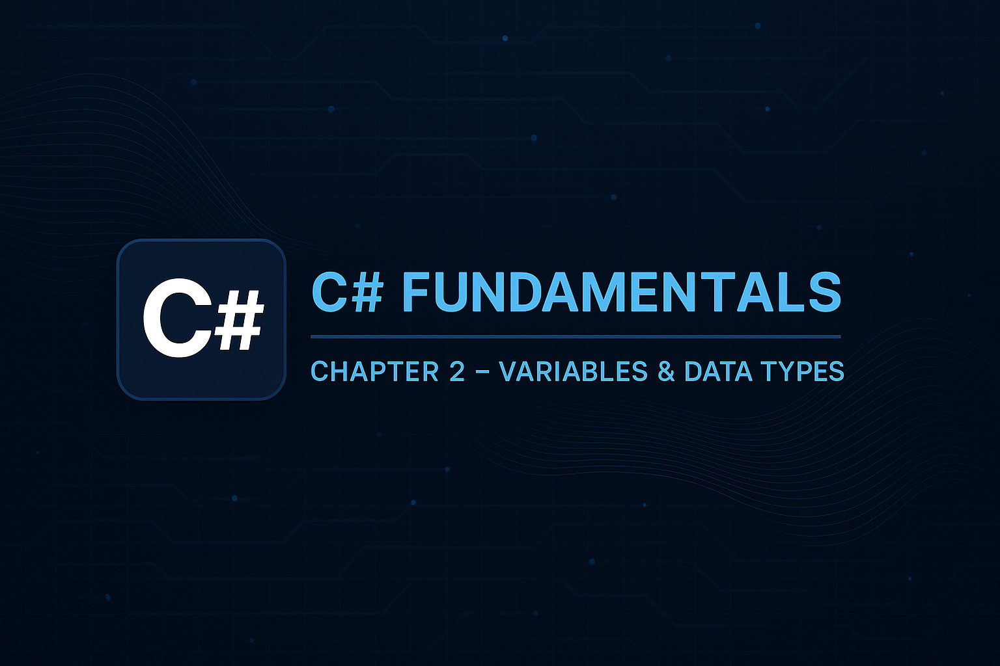

{:.banner}

# Програмування мовою C# — Частина 1
Навчально-методичний посібник для студентів спеціальності **«Професійна освіта (Цифрові технології)»**.

## Розділи
- [Зміст лекцій](./lectures/00_contents.md)
- [Лабораторні роботи](./labs/index.md)
- [Додаткові матеріали](./docs/index.md)
- [Про курс](./docs/about.md)
